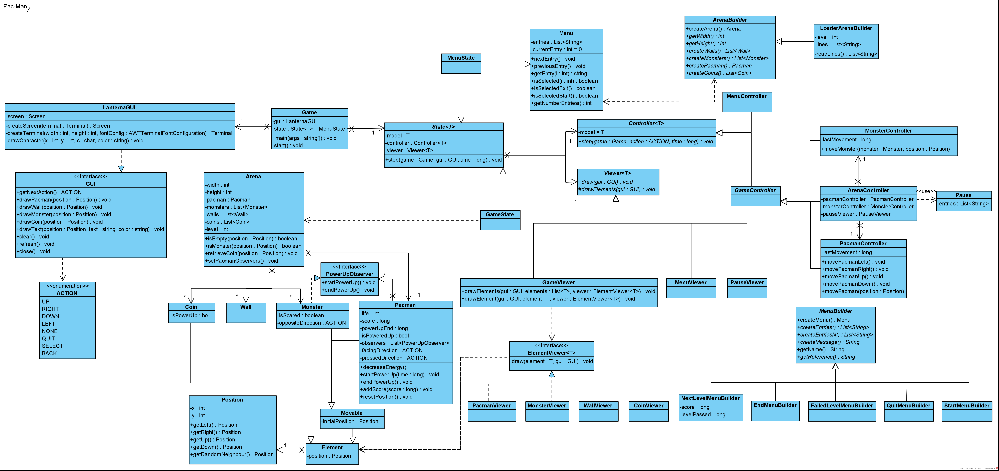
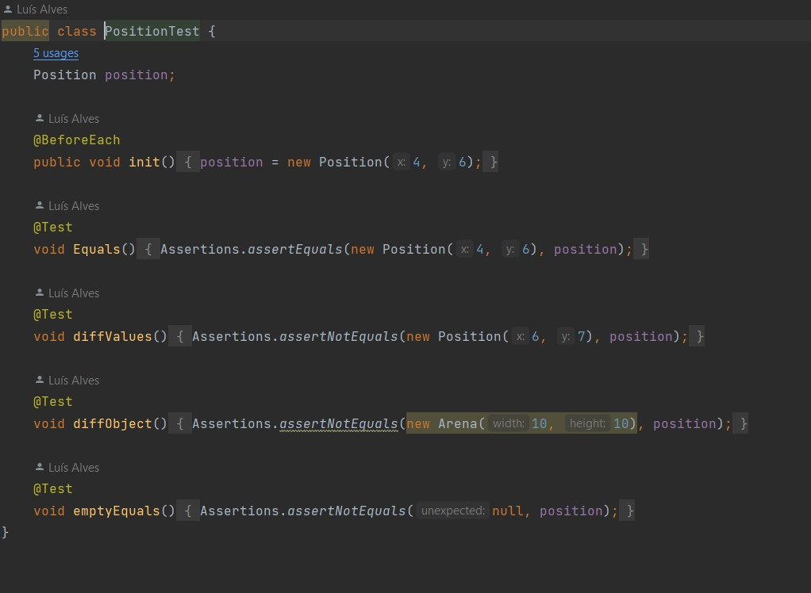
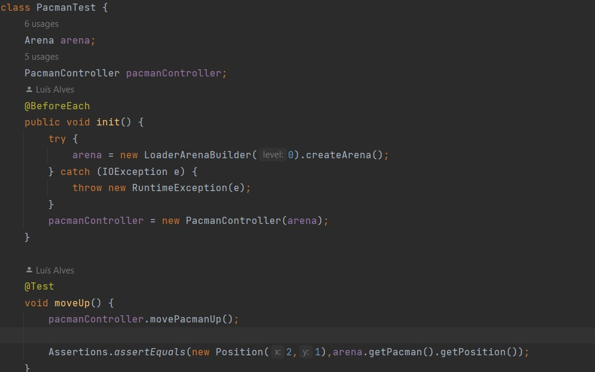

## LDTS_L06Gr01 - Pac-Man

In this text-based game inspired by the original 1980 released Pac-Man game, you win by collecting all the coins in the level you are in. You have 3 lives to try and complete the game and each life is taken when the main character makes contact with one of the ghosts/monsters.
The idea of the project is not the game or the complexity of it, but to be able to follow good design practices and use design patters and refactoring to fix code smells, all taught in class.

This project was developed by Gonçalo Martins (up202108707@fe.up.pt), Luís Alves (up202108727@fe.up.pt) and José Caribe (up202103344@fe.up.pt) for LDTS 2021⁄22.

### IMPLEMENTED FEATURES

- **Movement Input** - The game character will move 1 block on input, if the move is available to him (doesn't hit a wall).

- **Getting coins** - When the game character is on a block that also has a coin, the latter will be removed from said block and the coin counter will be decremented. Once the coin counter reaches 0, the player wins the game.

- **Start Menu** - When loading the game a Start Menu will appear with options to start the game and exit it. When in game you can press q to go back to the Start Menu at any time the client wishes to.

- **Life System** - A player has 3 lives to try and win the game. Every contact with a ghost will take you 1 life.

- **Ghost Enemies** - We have implemented enemies that take away one of the player's lives upon contact with said ghosts.

- **Power Up** - We implemented a power up just like the original game. These will be available in certain points of the map and when collected, they will make Pac-Man invincible for a certain amount of time and make him able to eat the Monsters.

- **Hidden Paths** - This one is also inspired on the original game. There are certain places in the map (frequently on the left and right side), that let you go directly to the other side of the map.

- **Permanent position movement** - The main character continuosly moves through the map. This means that you only need to input to change direction. If Pac-Man has room to move in the current direction, he will keep on going until he either dies, changes direction or hits a wall.

- **Game restart after each taken life** - We want the game to restart every time the player loses a life. When the 3 lives are over the game is over.

### DESIGN

- **The Pattern.** In our game we are mainly using two design patterns: State Pattern, Factory Method, Observer, Builder and Game Loop.

- **Implementation.** In the class diagram below, you can see how we modeled our classes in order to best integrate and use the design patterns we choose.

  

- **Consequences.** Despite the numerous advantages of patterns, there are some consequences such as:

 -In the case of the State pattern: it localizes state-specific behavior and partitions behavior for different states, it makes state transitions explicit and state objects can be shared.

  -Factory methods eliminate the need to bind application-specific classes into your code. The code only needs to deal with the Product interface, therefore it can work with any user-defined ConcreteProduct classes.

  -In the case of Observer: Abstract coupling between subject and observer. Unexpected updates.

  -The Builder object provides the director with an abstract interface for constructing the product. The interface lets the builder hide the representation and internal structure of the product. It also hides how the product gets assembled. Because the product is constructed through an abstract interface, all you have to do to change the product's internal representation is define a new kind of builder.
------

### KNOWN CODE SMELLS

- Classes Pacman, Monster, Coin and Wall can be considered Object-Orientation Abusers, because they barely used methods inherited from their parent, Class Element. We are still looking for a solution.

- Class GameController might only work as a middle man between Class Controller and Classes ArenaController, Monster Controller, Pacman Controller.

### DATA CLASS

Class Arena is mainly a data class with most methods being accessors to its fields and methods to set new fields.

### TESTING

We tested basic things like Pacman's movements in the arena, we also did some tests checking the integrity of some classes, trivial tests. However, we intend to add some more tests like mocks and stubs in order to demonstrate the good functioning of the game, but we don't know exactly where.

### SELF-EVALUATION

The group easily divided the work so that each student does a separate part of the program. If anyone on the group needs help on a class/function or can't find an error, the rest of the group will help in accordance.

**Example**:

- Gonçalo Martins: 33%
- Luís Alves: 33%
- José Caribe: 33%